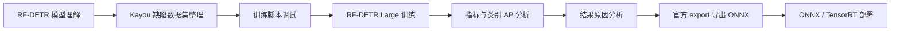
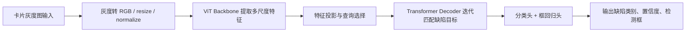
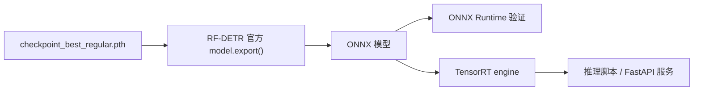

# Kayou RF-DETR 缺陷检测项目

本仓库记录了基于 **RF-DETR Large** 的卡游卡片表面缺陷检测工作，内容包括数据集整理、模型训练、测试结果分析、原因分析，以及后续 ONNX/TensorRT 部署流程。

项目目标是检测卡片灰度图中的细小缺陷，例如划伤、弱划伤、压印线、压印点等，为工业视觉检测场景提供可复现的训练与部署流程。

> 说明：当前 README 使用 Mermaid 图和外链图表展示结果，避免依赖未上传到仓库的本地 PNG 图片。后续如果把本地 `docs/assets/kayou_rfdetr/` 下的图片上传到 GitHub，可以再切换回仓库内相对路径图片。

## 项目流程



## 1. RF-DETR 模型说明

RF-DETR 是一种基于 Transformer 的目标检测模型。本项目不照搬官方介绍，只关注它在本任务里的作用：输入卡片图像后，模型通过视觉骨干网络提取图像特征，再由 Transformer 检测结构输出缺陷类别和位置。



RF-DETR 适合本项目的原因是它可以通过全局注意力建模复杂纹理背景，对线状、点状、小面积缺陷有一定表达能力。但卡片表面的弱划伤、压印点等缺陷非常细小，仍然会受到输入分辨率、标注质量和类别数量不均衡的影响。

## 2. 数据集情况

数据来自卡游卡片灰度图，缺陷通常具有以下特点：

- 目标小，像素占比低。
- 划伤、弱划伤和压印类缺陷与背景纹理接近。
- 卡片图案复杂，容易产生干扰纹理。
- 部分类别样本数量较少，类别分布不均衡。

本次训练包含 5 个检测类别：

| 类别 | 说明 |
| --- | --- |
| `HuaShang` | 划伤 |
| `HuaShangWeak` | 弱划伤 |
| `YaYinGangZhu` | 压印钢珠 |
| `YaYinLine` | 线状压印 |
| `YaYinPoint` | 点状压印 |

训练集和验证集标注数量分布如下：


| 类别 | train 标注数 | valid 标注数 |
| --- | ---: | ---: |
| `HuaShang` | 699 | 101 |
| `HuaShangWeak` | 136 | 16 |
| `YaYinGangZhu` | 91 | 16 |
| `YaYinLine` | 1077 | 145 |
| `YaYinPoint` | 3100 | 378 |

## 3. 训练工作

本项目使用 RF-DETR Large 进行目标检测训练，主要工作包括：

| 模块 | 工作内容 |
| --- | --- |
| 数据准备 | 整理 Kayou COCO 格式缺陷数据集 |
| 训练脚本 | 编写并调试 `training_scripts/train_kayou_rfdetr.py` |
| 模型训练 | 使用 RF-DETR Large 训练卡片缺陷检测模型 |
| 指标分析 | 基于 `metrics.csv` 分析 mAP、loss、F1、precision、recall |
| 报告整理 | 生成训练报告和可视化图表 |
| 部署整理 | 编写官方 `model.export()` 导出 ONNX 脚本，整理 TensorRT 部署流程 |

关键训练配置：

| 项目 | 配置 |
| --- | --- |
| 模型 | RF-DETR Large |
| 数据格式 | COCO |
| 输入尺寸 | 704 x 704 |
| batch size | 2 |
| 梯度累积 | 8 |
| 有效 batch | 16 |
| 最佳模型 | `checkpoint_best_regular.pth` |
| 最佳 epoch | epoch 29 |

## 4. 测试效果

核心指标如下：

| 指标 | 最佳 epoch | 最佳值 | 最终值 |
| --- | ---: | ---: | ---: |
| `val/mAP_50_95` | 29 | 0.3566 | 0.3466 |
| `val/mAP_50` | 20 | 0.6720 | 0.6622 |
| `val/mAP_75` | 18 | 0.3478 | 0.3208 |
| `val/F1` | 30 | 0.7028 | 0.7024 |
| `val/precision` | 30 | 0.8253 | 0.8187 |
| `val/recall` | 18 | 0.6531 | 0.6312 |

### 整体指标图


### 各类别 AP


最终各类别 AP：

| 类别 | final AP | 表现 |
| --- | ---: | --- |
| `HuaShang` | 0.4726 | 较好 |
| `YaYinGangZhu` | 0.4628 | 较好 |
| `YaYinLine` | 0.3374 | 中等偏弱 |
| `YaYinPoint` | 0.2708 | 较弱 |
| `HuaShangWeak` | 0.1895 | 最弱 |

## 5. 结果分析

从测试结果看，模型已经具备初步可用的缺陷检测能力：

- `val/mAP_50` 达到 0.6720，说明模型能较好找到缺陷的大致位置。
- `val/F1` 达到 0.7028，整体检测能力已经形成。
- `precision` 高于 `recall`，说明误检控制相对较好，但仍存在漏检。
- `mAP_50_95` 明显低于 `mAP_50`，说明高 IoU 下的精确定位仍有难度。

## 6. 原因分析

效果差异主要来自以下几个方面：

| 原因 | 说明 |
| --- | --- |
| 小目标问题 | `YaYinPoint` 在缩放到 704 x 704 后像素占比很小，定位难度高 |
| 弱纹理问题 | `HuaShangWeak` 与背景纹理接近，对比度低，容易被模型当作正常背景 |
| 类别不均衡 | 少数类样本数量明显少于大类，普通随机采样下学习不足 |
| 细长目标定位敏感 | 划伤和线状压印对框的位置、高度很敏感，IoU 容易下降 |
| 标注一致性影响 | 小缺陷边界框轻微偏差就会造成 IoU 明显下降，影响 `mAP_75` 和 `mAP_50_95` |
| 训练策略基础 | 当前训练没有专门加入弱类重采样、小目标增强或类别均衡采样 |

后续优化建议：

- 增加 `HuaShangWeak`、`YaYinGangZhu` 的样本数量。
- 针对 `YaYinPoint` 做局部裁剪、放大、小目标增强。
- 尝试类别均衡采样或弱类 oversampling。
- 复查漏检和误检样本，修正边界框和困难标注。
- 尝试更高输入分辨率，并重新评估小目标 AP。

## 7. 部署流程

推荐部署路线：



### 7.1 官方 export 导出 ONNX

本项目提供脚本：

```text
scripts/export_kayou_rfdetr_onnx.py
```

运行方式：

```powershell
python -S scripts\export_kayou_rfdetr_onnx.py
```

默认配置：

| 参数 | 值 |
| --- | --- |
| 权重 | `output/kayou_rfdetr_large_coco/checkpoint_best_regular.pth` |
| 输出目录 | `deploy/kayou_rfdetr_large_onnx` |
| 输入尺寸 | 704 x 704 |
| batch | 1 |
| opset | 17 |
| 导出接口 | RF-DETR 官方 `model.export()` |

### 7.2 ONNX 转 TensorRT

导出 ONNX 后，可使用 NVIDIA TensorRT 的 `trtexec` 转换：

```powershell
$onnx = "deploy\kayou_rfdetr_large_onnx\rfdetr-large.onnx"
$engine = "deploy\kayou_rfdetr_large_onnx\kayou_rfdetr_large_fp16.engine"

trtexec `
  --onnx="$onnx" `
  --saveEngine="$engine" `
  --fp16 `
  --memPoolSize=workspace:4096
```

### 7.3 推理服务

最终部署程序包含：

```text
图片输入 -> 前处理 -> 模型推理 -> 后处理 -> JSON 输出
```

前处理：

```text
RGB / 灰度转 RGB
resize 到 704 x 704
归一化到 [0, 1]
ImageNet normalize
NCHW: [1, 3, 704, 704]
```

后处理：

```text
解析 boxes / scores / labels
按置信度过滤
坐标映射回原图
输出检测框和类别
```

## 8. 文档

- [Kayou RF-DETR 项目报告](docs/kayou_rfdetr_project_report.md)
- [ONNX 到 TensorRT 部署说明](docs/kayou_rfdetr_onnx_tensorrt_deployment.md)

